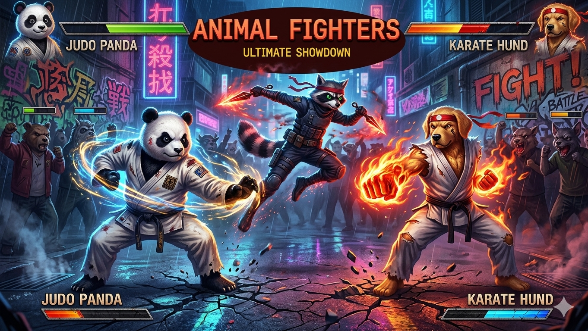

# Animal Fighters

A 2D arcade-style fighting game featuring anthropomorphic animal characters battling it out with martial arts. Built entirely as a zero-dependency, single-file browser game with procedurally rendered graphics.

*Designed and built by my daughter. This game is dedicated to her.*



---

## Characters

| Character | Fighting Style | Speed | Power | Defense |
|-----------|---------------|-------|-------|---------|
| Judo Panda | Judo | 3 | 9 | 8 |
| Ninja Raccoon | Ninjutsu | 10 | 7 | 5 |
| Karate Dog | Karate | 6 | 8 | 7 |

## How to Play

Open `index.html` in any modern web browser. Click or press any key to initialize audio, then press Enter to start.

Alternatively, serve with any static file server for proper music playback:

```bash
python -m http.server 8080
```

### Controls

| Key | Action |
|-----|--------|
| Arrow Left/Right | Move |
| Arrow Up | Jump |
| Arrow Down | Crouch |
| A | Low Kick |
| S | High Kick |
| D | Low Punch |
| F | High Punch |
| Space | Block |
| Enter | Confirm / Start |

## Gameplay

- **Player vs. AI** -- Select your fighter and battle through best-of-3 round matches
- **4 attack types** with different damage multipliers and reach
- **Blocking** negates incoming damage
- **Crouching** dodges high attacks
- **Jump attacks** deal bonus damage
- **Combo system** tracks consecutive hits
- **99-second round timer**

## Technical Highlights

- Single HTML file (~2,800 lines), no build step, no frameworks, no external dependencies
- All character sprites drawn procedurally using Canvas 2D API (fur textures, clothing folds, muscle definition, shadows)
- Procedural sound effects via Web Audio API
- Background music via MP3 tracks
- Animated backgrounds with sunset sky, pagodas, market stalls, and crowd NPCs
- Particle effects, screen shake, and hit sparks
- AI opponent with distance-based decision making

## File Structure

```
animal-fighters/
  index.html           # The game (final version)
  intro.mp3            # Intro screen music
  fighter_select.mp3   # Character select music
  fight.mp3            # Fight stage music
  index_v1.html        # Earlier version (v1)
  index_v2.html        # Earlier version (v2 - Turbo)
  index_v3.html        # Earlier version (v3 - Music sequencer)
  index_v4.html        # Earlier version (v4 - Beast Fighters)
```

## Requirements

Any modern web browser with HTML5 Canvas and Web Audio API support (Chrome, Firefox, Edge, Safari).
